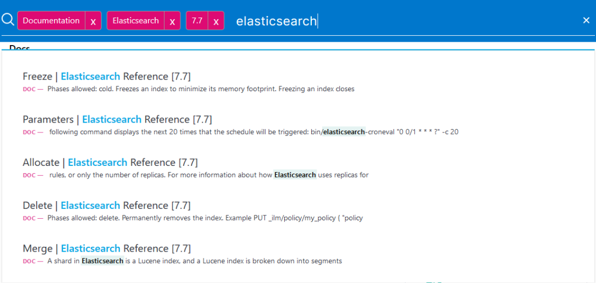
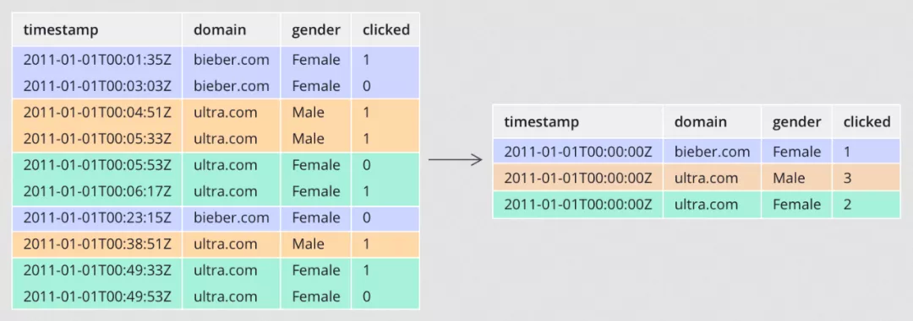
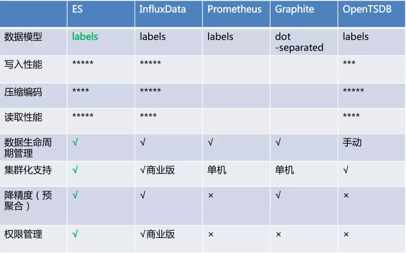
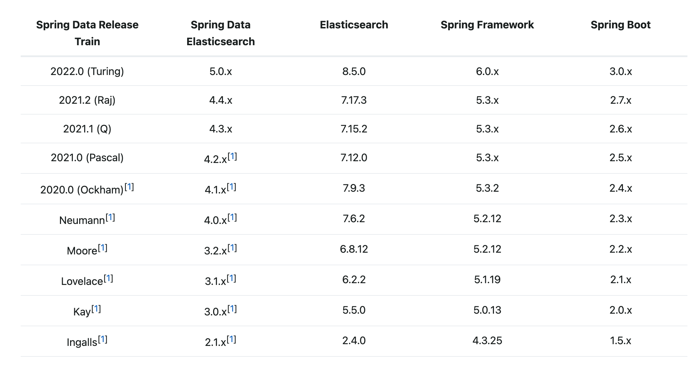
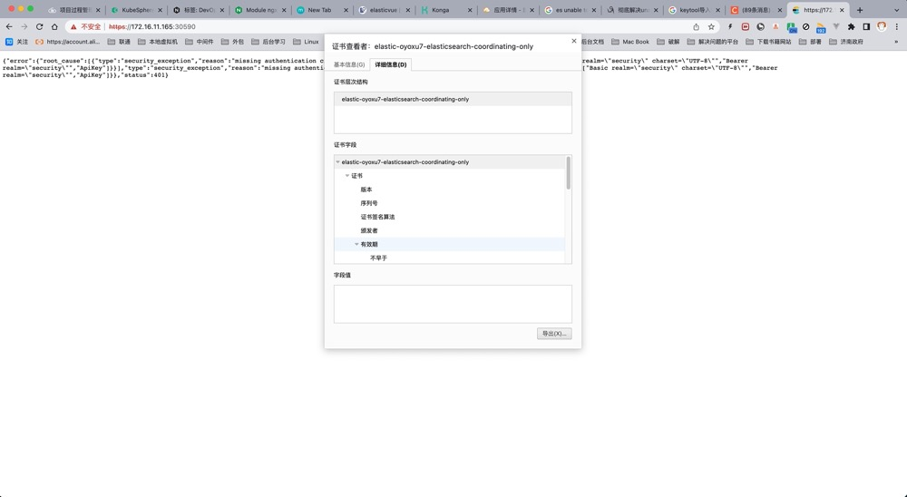

# 集成Spring Data ElasticSearch

本例中使用了Spring Data ElasticSearch对ElasticSearch进行集成，
同时增加了一些自定义参数对ElasticSearch Http和Https不同协议的支持。

## 什么是ElasticSearch？

### 1、什么是ElasticSearch？

Elasticsearch是什么，不同的人有不同的理解定位，下面就谈谈我的认知：

#### 1）Elasticsearch是搜索引擎

Elasticsearch在搜索引擎数据库领域排名绝对第一，内核基于Lucene构建，支持全文搜索是职责所在，提供了丰富友好的API。个人早期基于Lucene构建搜索应用，需要考虑的因素太多，自接触到Elasticsearch就再无自主开发搜索应用。普通工程师要想掌控Lucene需要一些代价，且很多机制并不完善，需要做大量的周边辅助程序，而Elasticsearch几乎都已经帮你做完了。

#### 2）Elasticsearch不是搜索引擎

说它不是搜索引擎，估计很多从业者不认可，在个人涉及到的项目中，传统意义上用Elasticsearch来做全文检索的项目占比越来越少，多数时候是用来做精确查询加速，查询条件很多，可以任意组合，查询速度很快，替代其它很多数据库复杂条件查询的场景需求；甚至有的数据库产品直接使用Elasticsearch做二级索引，如HBase、Redis等。Elasticsearch由于自身的一些特性，更像一个多模数据库。

#### 3）Elasticsearch是数据库

Elasticsearch使用Json格式来承载数据模型，已经成为事实上的文档型数据库，虽然底层存储不是Json格式，同类型产品有大名鼎鼎的MongoDB，不过二者在产品定位上有差别，Elasticsearch更加擅长的基于查询搜索的分析型数据库，倾向OLAP；MongoDB定位于事务型应用层面OLTP，虽然也支持数据分析，笔者简单应用过之后再无使用，谁用谁知道。

#### 4）Elasticsearch不是数据库

Elasticsearch不是关系型数据库，内部数据更新采用乐观锁，无严格的ACID事务特性，任何企图将它用在关系型数据库场景的应用都会有很多问题，很多其它领域的从业者喜欢拿这个来作为它的缺陷，重申这不是Elasticsearch的本质缺陷，是产品设计定位如此。

### 2、ElasticSearch可以做什么？

Elasticsearch虽然是基于Lucene构建，但应用领域确实非常宽泛。

#### 1）全文检索

Elasticsearch靠全文检索起步，将Lucene开发包做成一个数据产品，屏蔽了Lucene各种复杂的设置，为开发人员提供了很友好的便利。很多传统的关系型数据库也提供全文检索，有的是基于Lucene内嵌，有的是基于自研，与Elasticsearch比较起来，功能单一，性能也表现不是很好，扩展性几乎没有。

如果，你的应用有全文检索需求，建议你优先迁移到Elasticsearch平台上来，其提供丰富的Full text queries会让你惊讶，一次用爽，一直用爽。



图示：Elasticsearch官方搜索文档

#### 2）应用查询

Elasticsearch最擅长的就是查询，基于倒排索引核心算法，查询性能强于B-Tree类型所有数据产品，尤其是关系型数据库方面。当数据量超过千万或者上亿时，数据检索的效率非常明显。

个人更看中的是Elasticsearch在通用查询应用场景，关系型数据库由于索引的左侧原则限制，索引执行必须有严格的顺序，如果查询字段很少，可以通过创建少量索引提高查询性能，如果查询字段很多且字段无序，那索引就失去了意义；相反Elasticsearch是默认全部字段都会创建索引，且全部字段查询无需保证顺序，所以我们在业务应用系统中，大量用Elasticsearch替代关系型数据库做通用查询，自此之后对于关系型数据库的查询就很排斥，除了最简单的查询，其余的复杂条件查询全部走Elasticsearch。

#### 3）大数据领域

Elasticserach已经成为大数据平台对外提供查询的重要组成部分之一。大数据平台将原始数据经过迭代计算，之后结果输出到一个数据库提供查询，特别是大批量的明细数据。

这里会面临几个问题，一个问题是大批量明细数据的输出，如何能在极短的时间内写到数据库，传统上很多数据平台选择关系型数据库提供查询，比如MySQL，之前在这方面吃过不少亏，瞬间写入性能极差，根本无法满足要求。另一个问题是对外查询，如何能像应用系统一样提供性能极好的查询，不限制查询条件，不限制字段顺序，支持较高的并发，支持海量数据快速检索，也只有Elasticsearch能够做到比较均衡的检索。

从官方的发布版本新特性来看，Elasticseacrch志在大数据分析领域，提供了基于列示存储的数据聚合，支持的聚合功能非常多，性能表现也不错，笔者有幸之前大规模深度使用过，颇有感受。

Elasticsearch为了深入数据分析领域，产品又提供了数据Rollup与数据Transform功能，让检索分析更上一层楼。在数据Rollup领域，Apache
Druid的竞争能力很强，笔者之前做过一些对比，单纯的比较确实不如Druid，但自Elasticsearch增加了Transfrom功能，且单独创建了一个Transfrom的节点角色，个人更加看好Elasticseach，跳出了Rollup基于时间序列的限制。



图示：Rollup执行过程数据转换示意图

#### 4）日志检索

著名的ELK三件套，讲的就是Elasticsearch，Logstash，Kibana，专门针对日志采集、存储、查询设计的产品组合。很多第一次接触到Elasticsearch的朋友，都会以为Elasticsearch是专门做日志的，其实这些都是误解，只是说它很擅长这个领域，在此领域大有作为，名气很大。

日志自身特点没有什么通用的规范性，人为的随意性很大，日志内容也是任意的，更加需求全文检索能力，传统技术手段本身做全文检索很是吃力。而Elasticsearch本身起步就是靠全文检索，再加上其分布式架构的特性，非常符合海量日志快速检索的场景。今天如果还发现有IT从业人员用传统的技术手段做日志检索，应该要打屁股了。

如今已经从ELK三件套发展到Elastic Stack了，新增加了很多非常有用的产品，大大增强了日志检索领域。

#### 5）监控领域

指标监控，Elasticsearch进入此领域比较晚，却赶上了好时代，Elasticsearch由于其倒排索引核心算法，也是支持时序数据场景的，性能也是相当不错的，在功能性上完全压住时序数据库。

Elasticsearch搞监控得益于其提供的Elastic
Stack产品生态，丰富完善，很多时候监控需要立体化，除了指标之外，还需要有各种日志的采集分析，如果用其它纯指标监控产品，如Promethues，遇到有日志分析的需求，还必须使用Elasticsearch，这对于技术栈来说，又扩增了，相应的掌控能力会下降，个人精力有限，无法同时掌握很多种数据产品，如此选择一个更加通用的产品才符合现实。



图示：Elastic性能对比时序数据库（来自腾讯云分享）

6）机器学习

机器学习最近几年风吹的很大，很多数据产品都集成了，Elasticsearch也必须有，而且做的更好，真正将机器学习落地成为一个产品 ，简化使用，所见所得；而不像其它数据产品，仅仅集成算法包，使用者还必须开发很多应用支持。

Elasticsearch机器学习提供了两种方式，一种是异常检测类型，属于无监督学习，采用聚类模型，通常应用在安全分析领域，检测异常访问等；一种是数据帧分析，属于分类与回归，属于监督学习，可用于在业务模型领域，如电商行业，价格模型分析。

Elasticsearch本身是数据平台，集成了部分机器学习算法，同时又集成了Kibana可视化操作，使得从数据采集、到模型训练、到模型预测应用都可以一键式完成。

Elasticserach提供的机器学习套件，个人认为最应该应用在数据质量这个领域，帮助大数据平台自动检测数据质量，从而降低人力提供效率。

## Spring Data Elasticsearch

Spring Data for Elasticsearch是Spring Data项目的一部分，该项目旨在为新数据存储提供熟悉且一致的基于Spring的编程模型，同时保留特定于存储的特性和功能。

Spring Data Elasticsearch 项目提供了与 Elasticsearch 搜索引擎的集成。Spring Data
Elasticsearch的关键功能领域是以POJO为中心的模型，用于与Elastichsearch文档进行交互，并轻松编写存储库样式的数据访问层。

### 功能

- 支持使用`@Configuration`Java配置文件或者XML进行配置
- `ElasticsearchTemplate`用于提高执行常见ES操作的效率。包括文档和POJO之间的集成对象映射
- Feature Rich Object Mapping integrated with Spring’s Conversion Service
- 基于注解的映射元数据，但可扩展以支持其他元数据格式
- 可以使用Jpa `Repository` 直接使用

### 版本对应

下表显示了 Spring Data 发布系列使用的 Elasticsearch 版本和其中包含的 Spring Data Elasticsearch 版本，以及引用该特定 Spring 数据发布系列的 Spring Boot 版本。给出的
Elasticsearch 版本显示了使用哪些客户端库构建和测试了 Spring Data Elasticsearch。



### 自签证书导入

#### 下载证书

从浏览器访问Https协议的ES地址



**点击导出按钮，输入要导出的文件名：文件名.crt 。**

#### 导入证书

执行以下命令将证书导入：

```shell
sudo keytool -import -alias <证书别名> -keystore cacerts.keystore -file your.crt
```

## 常见问题

### 长时间不连接ES出现Connection reset by peer

报这个错的原因是 因为服务端已经关闭了链接，但是客户端还在使用这个链接

1. 为什么服务端会关闭链接？

    linux查看超时时间默认为两小时

``` shell
[root@localhost docker]# sysctl net.ipv4.tcp_keepalive_time
net.ipv4.tcp_keepalive_time = 7200
```

2. 客户端为什么一直持有？

客户端默认的KeepAlive时间为-1，也就是一直不过期。
```java
public long getKeepAliveDuration(final HttpResponse response, final HttpContext context) {
        Args.notNull(response, "HTTP response");
        final HeaderElementIterator it = new BasicHeaderElementIterator(
                response.headerIterator(HTTP.CONN_KEEP_ALIVE));
        while (it.hasNext()) {
            final HeaderElement he = it.nextElement();
            final String param = he.getName();
            final String value = he.getValue();
            if (value != null && param.equalsIgnoreCase("timeout")) {
                try {
                    return Long.parseLong(value) * 1000;
                } catch(final NumberFormatException ignore) {
                }
            }
        }
        return -1;
    }
```


解决办法：
有俩个解决办法：
1. 开启客户端的TCP探测功能，这样就可以一直保持连接。最优方案

```java
public void customize(HttpAsyncClientBuilder builder)  {

        // 保持连接检测对方主机是否崩溃，避免（服务器）永远阻塞于TCP连接的输入 需要net.ipv4.tcp_keepalive_time配合
		builder.setDefaultIOReactorConfig(IOReactorConfig.custom()
		.setSoKeepAlive(true).build());
		
} 
```

这个需要操作系统的tcp_keepalive_time参数来配合。

查看探测
``` shell
[root@localhost docker]# sysctl 
net.ipv4.tcp_keepalive_time = 7200
net.ipv4.tcp_keepalive_intvl = 75
net.ipv4.tcp_keepalive_probes = 9
```

通常应将net.ipv4.tcp_keepalive_time设置为300。
默认值7200秒（即2小时）几乎肯定太长，无法等待发送第一个keepalive。


TCP KeepAlive机制主要涉及3个参数：

- tcp_keepalive_time (integer; default: 7200; since Linux 2.2)
  在TCP保活打开的情况下，最后一次数据交换到TCP发送第一个保活探测包的间隔，即允许的持续空闲时长，或者说每次正常发送心跳的周期，默认值为7200s（2h）。

- tcp_keepalive_probes (integer; default: 9; since Linux 2.2)

在tcp_keepalive_time之后，最大允许发送保活探测包的次数，到达此次数后直接放弃尝试，并关闭连接，默认值为9（次）。

- tcp_keepalive_intvl (integer; default: 75; since Linux 2.4)

在tcp_keepalive_time之后，没有接收到对方确认，继续发送保活探测包的发送频率，默认值为75s。

2. 设置HttpAsyncClientBuilder的ConnectionKeepAliveStrategy连接时间 ，当 Elasticsearch 客户端与服务器保持良好连接时，此配置会影响 HTTP 连接的重用

```java
class CustomConnectionKeepAliveStrategy extends DefaultConnectionKeepAliveStrategy {
		@Override
		public long getKeepAliveDuration(HttpResponse response, HttpContext context) {
			long keepAlive = super.getKeepAliveDuration(response, context);

			if (keepAlive == -1) {

				keepAlive = 7100;

			}
			return keepAlive;
		}
}
```


```java 
builder.setKeepAliveStrategy(new CustomConnectionKeepAliveStrategy());
```


> 参考 [GitHub Issue](https://github.com/elastic/elasticsearch/issues/65213)